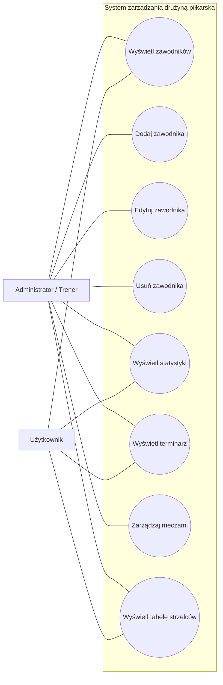

# ⚽ System zarządzania drużyną piłkarską

## 1. Opis projektu

System zarządzania drużyną piłkarską jest aplikacją umożliwiającą
przechowywanie oraz prezentowanie informacji dotyczących zawodników
i rozegranych oraz zaplanowanych spotkań.

System pozwala na zarządzanie listą zawodników, ich numerami,
pozycjami oraz statystykami.

Umożliwia również zarządzanie terminarzem meczów oraz prezentowanie
tabeli strzelców.

## 2. Cel projektu

Celem projektu jest stworzenie prostego systemu pozwalającego
na wygodne zarządzanie drużyną piłkarską oraz przechowywanie
najważniejszych informacji dotyczących zawodników i spotkań.

Projekt może być wykorzystany jako aplikacja dla amatorskiej
drużyny piłkarskiej, projekt edukacyjny lub baza do stworzenia
bardziej rozbudowanego systemu zarządzania klubem.

## 3. Główne funkcje

System umożliwia:

- wyświetlanie listy zawodników,
- dodawanie zawodników,
- edytowanie danych zawodników,
- usuwanie zawodników,
- przypisywanie numerów zawodnikom,
- przypisywanie pozycji zawodnikom,
- przechowywanie liczby rozegranych meczów,
- przechowywanie liczby zdobytych goli,
- przechowywanie liczby asyst,
- wyświetlanie terminarza,
- dodawanie meczów,
- edytowanie meczów,
- usuwanie meczów,
- wyświetlanie wyników spotkań,
- wyświetlanie tabeli strzelców.

## 4. Pozycje zawodników

System obsługuje następujące pozycje:

- Bramkarz
- Obrońca
- Pomocnik
- Napastnik

## 5. Statystyki zawodników

Dla zawodnika przechowywane są:

- liczba rozegranych meczów,
- liczba zdobytych goli,
- liczba asyst.

## 6. Terminarz meczów

Dla meczu przechowywane są:

- przeciwnik,
- data meczu,
- godzina meczu,
- miejsce rozegrania,
- wynik spotkania.

## 7. Tabela strzelców

Tabela strzelców przedstawia zawodników uporządkowanych według
liczby zdobytych goli.

## 8. Aktorzy

### Użytkownik

Użytkownik może przeglądać informacje znajdujące się w systemie:

- zawodników,
- statystyki,
- terminarz,
- wyniki,
- tabelę strzelców.

### Administrator / Trener

Administrator lub trener może zarządzać danymi:

- dodawać zawodników,
- edytować zawodników,
- usuwać zawodników,
- dodawać mecze,
- edytować mecze,
- usuwać mecze.

## 9. Technologie

Projekt wykorzystuje:

- HTML5 – struktura aplikacji,
- CSS3 – wygląd i responsywność,
- JavaScript – logika aplikacji,
- Node.js,
- Express,
- SQLite – przechowywanie danych.

## 10. Diagram przypadków użycia

## 11. Dokumentacja

- [Aktorzy](docs/aktorzy.md)
- [Wymagania](docs/wymagania.md)
- [Diagram przypadków użycia](docs/diagram-przypadkow-uzycia.md)
- [Diagram aktywności](docs/diagram-aktywnosci.md)
- [Diagram sekwencji](docs/diagram-sekwencji.md)
- [Diagram klas](docs/diagram-klas.md)

### Przypadki użycia

- [PU-01 – Wyświetl zawodników](docs/przypadki-uzycia/PU-01-wyswietl-zawodnikow.md)
- [PU-02 – Dodaj zawodnika](docs/przypadki-uzycia/PU-02-dodaj-zawodnika.md)
- [PU-03 – Edytuj zawodnika](docs/przypadki-uzycia/PU-03-edytuj-zawodnika.md)
- [PU-04 – Usuń zawodnika](docs/przypadki-uzycia/PU-04-usun-zawodnika.md)
- [PU-05 – Wyświetl statystyki](docs/przypadki-uzycia/PU-05-wyswietl-statystyki.md)
- [PU-06 – Wyświetl terminarz](docs/przypadki-uzycia/PU-06-wyswietl-terminarz.md)
- [PU-07 – Wyświetl tabelę strzelców](docs/przypadki-uzycia/PU-07-wyswietl-tabele-strzelcow.md)
