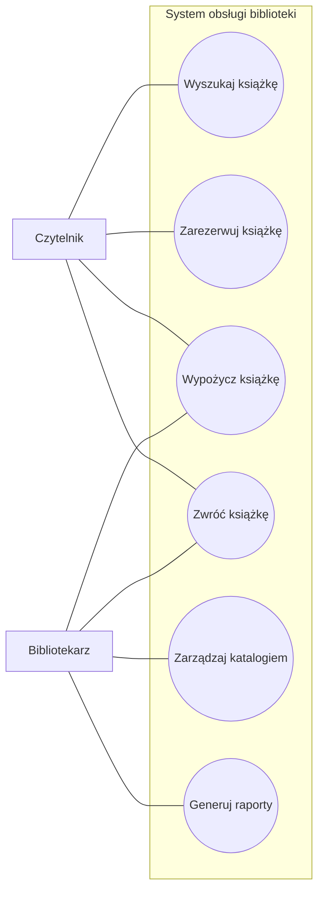

# 📚 System obsługi biblioteki

## 1. Opis projektu

System obsługi biblioteki jest systemem informatycznym wspierającym
obsługę czytelników oraz pracę bibliotekarzy.

System umożliwia wyszukiwanie książek w katalogu, rezerwowanie,
wypożyczanie i zwracanie książek.

Bibliotekarz może dodatkowo zarządzać katalogiem oraz generować raporty.

## 2. Dostęp do systemu

System może być dostępny poprzez:

- stronę WWW,
- aplikację,
- terminal znajdujący się w bibliotece.

Wyszukiwanie książek jest dostępne publicznie i nie wymaga zalogowania.

## 3. Aktorzy

### Czytelnik

Czytelnik korzysta z systemu w celu:

- wyszukiwania książek,
- rezerwowania książek,
- wypożyczania książek,
- zwracania książek.

### Bibliotekarz

Bibliotekarz jest pracownikiem biblioteki i korzysta z systemu w celu:

- obsługi wypożyczeń,
- obsługi zwrotów,
- zarządzania katalogiem,
- generowania raportów.

## 4. Przypadki użycia

System zawiera następujące przypadki użycia:

1. Wyszukaj książkę
2. Zarezerwuj książkę
3. Wypożycz książkę
4. Zwróć książkę
5. Zarządzaj katalogiem
6. Generuj raporty

## 5. Diagram przypadków użycia

## 6. Dokumentacja przypadków użycia

### PU-01 – Wyszukaj książkę

Aktor główny: **Czytelnik**

Cel: odnalezienie w katalogu książki spełniającej określone kryteria,
np. tytuł lub autor.

### PU-02 – Zarezerwuj książkę

Aktor główny: **Czytelnik**

Cel: umożliwienie czytelnikowi zarezerwowania wybranej książki.

### PU-03 – Wypożycz książkę

Aktor główny: **Czytelnik**

Aktor wspierający: **Bibliotekarz**

Cel: umożliwienie czytelnikowi wypożyczenia książki.

### PU-04 – Zwróć książkę

Aktor główny: **Czytelnik**

Aktor wspierający: **Bibliotekarz**

Cel: zarejestrowanie zwrotu wypożyczonej książki.

### PU-05 – Zarządzaj katalogiem

Aktor główny: **Bibliotekarz**

Cel: zarządzanie informacjami o książkach znajdujących się w katalogu.

### PU-06 – Generuj raporty

Aktor główny: **Bibliotekarz**

Cel: generowanie raportów dotyczących funkcjonowania biblioteki.

## 7. Dokumentacja

- [Aktorzy](docs/aktorzy.md)
- [Diagram przypadków użycia](docs/diagram-przypadkow-uzycia.md)
- [Diagram aktywności](docs/diagram-aktywnosci.md)
- [Diagram sekwencji](docs/diagram-sekwencji.md)
- [Diagram klas](docs/diagram-klas.md)

### Przypadki użycia

- [PU-01 – Wyszukaj książkę](docs/przypadki-uzycia/PU-01-wyszukaj-ksiazke.md)
- [PU-02 – Zarezerwuj książkę](docs/przypadki-uzycia/PU-02-zarezerwuj-ksiazke.md)
- [PU-03 – Wypożycz książkę](docs/przypadki-uzycia/PU-03-wypozycz-ksiazke.md)
- [PU-04 – Zwróć książkę](docs/przypadki-uzycia/PU-04-zwroc-ksiazke.md)
- [PU-05 – Zarządzaj katalogiem](docs/przypadki-uzycia/PU-05-zarzadzaj-katalogiem.md)
- [PU-06 – Generuj raporty](docs/przypadki-uzycia/PU-06-generuj-raporty.md)

## 8. Technologie

Projekt może zostać zrealizowany jako aplikacja internetowa.

Przykładowe technologie:

- HTML
- CSS
- JavaScript
- baza danych SQL

## 9. Cel projektu

Celem projektu jest zaprojektowanie systemu informatycznego
wspierającego obsługę biblioteki oraz ułatwiającego czytelnikom
korzystanie z katalogu bibliotecznego.
