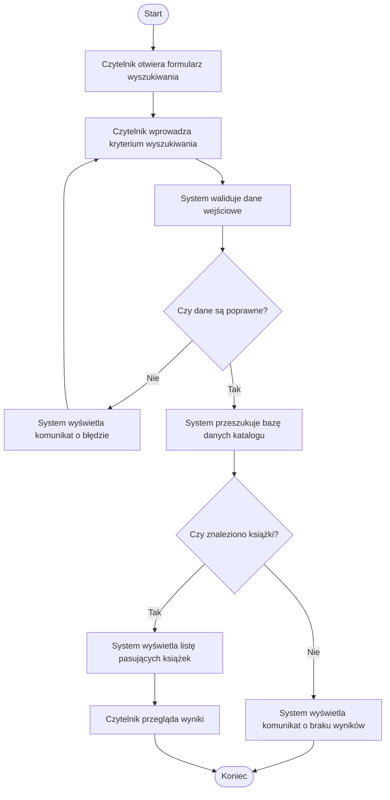

# Diagram aktywności – Wyszukaj książkę

## Opis

Diagram przedstawia przebieg wyszukiwania książki.

Czytelnik otwiera formularz, wprowadza kryteria wyszukiwania,
a system sprawdza poprawność danych.

Następnie system przeszukuje bazę danych katalogu.

Jeżeli znaleziono książki, system wyświetla listę wyników.

Jeżeli nie znaleziono żadnej książki, system wyświetla informację
o braku wyników.
