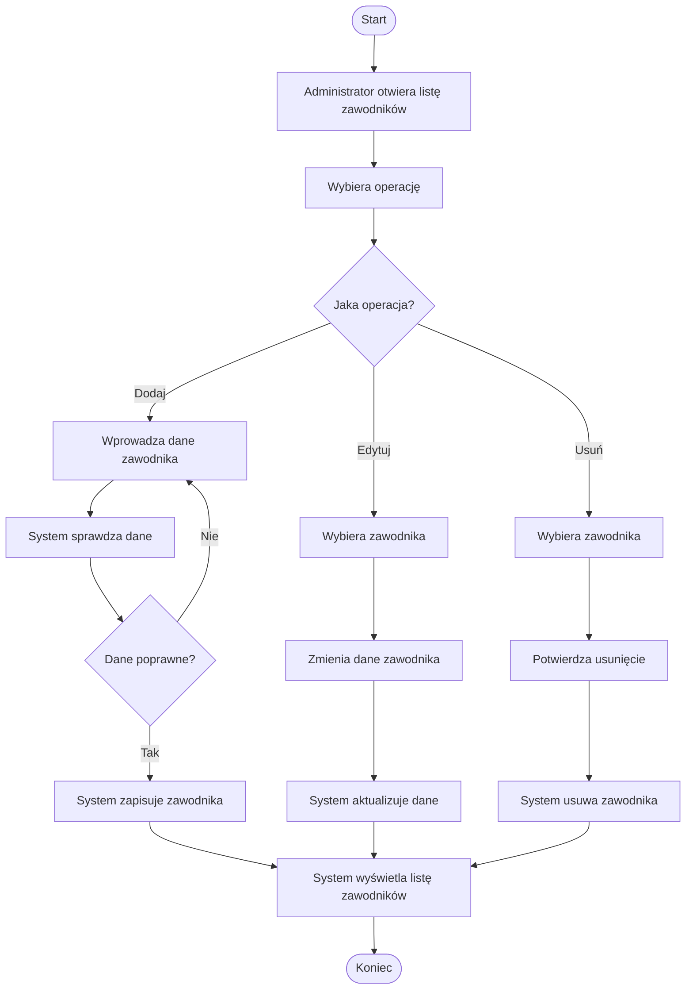

# Diagram aktywności – zarządzanie zawodnikiem

## Opis

Diagram przedstawia proces zarządzania zawodnikiem.

Administrator może dodać, edytować lub usunąć zawodnika.

Podczas dodawania danych system sprawdza ich poprawność.
