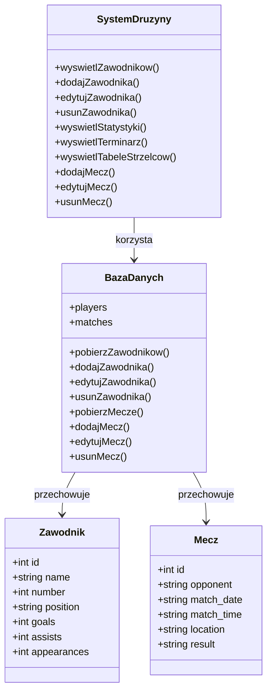

# Diagram klas

## Klasa Zawodnik

Przechowuje informacje o zawodniku:

- identyfikator,
- imię i nazwisko,
- numer,
- pozycję,
- gole,
- asysty,
- występy.

## Klasa Mecz

Przechowuje informacje o meczu:

- przeciwnika,
- datę,
- godzinę,
- miejsce,
- wynik.

## Baza danych

Baza danych przechowuje informacje o zawodnikach i meczach.

## System drużyny

System odpowiada za wykonywanie operacji na danych.
