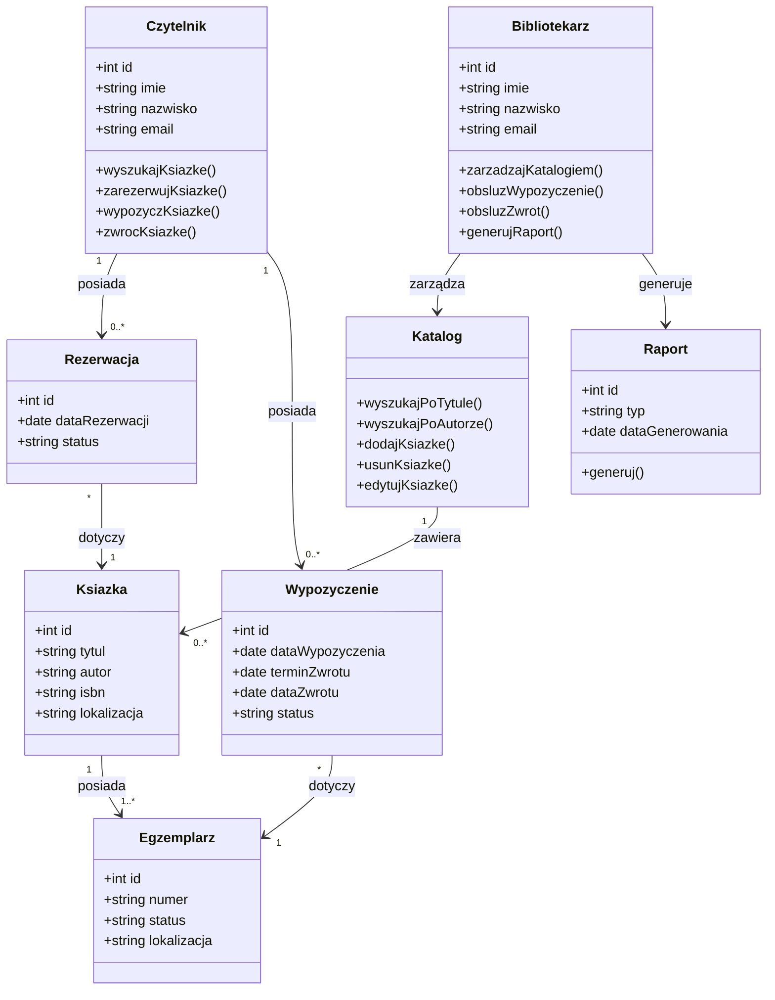

# Diagram klas

## Opis klas

### Czytelnik

Reprezentuje osobę korzystającą z biblioteki.

### Bibliotekarz

Reprezentuje pracownika biblioteki.

### Ksiazka

Przechowuje informacje o książce.

### Egzemplarz

Reprezentuje konkretny egzemplarz książki.

### Rezerwacja

Przechowuje informacje o rezerwacji książki.

### Wypozyczenie

Przechowuje informacje dotyczące wypożyczenia książki.

### Katalog

Przechowuje informacje o książkach i umożliwia zarządzanie nimi.

### Raport

Reprezentuje raport wygenerowany przez bibliotekarza.
