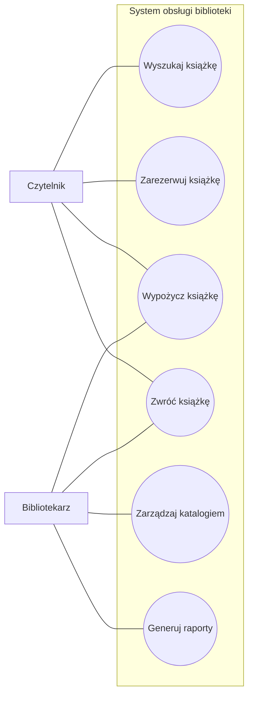

# Diagram przypadków użycia

## System obsługi biblioteki

## Opis

### Czytelnik

Czytelnik może:

- wyszukać książkę,
- zarezerwować książkę,
- wypożyczyć książkę,
- zwrócić książkę.

### Bibliotekarz

Bibliotekarz może:

- obsługiwać wypożyczenia,
- obsługiwać zwroty,
- zarządzać katalogiem,
- generować raporty.
