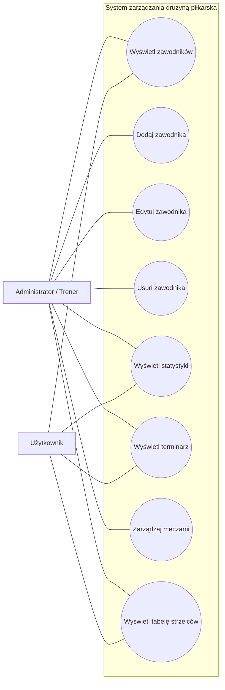

# Diagram przypadków użycia

## System zarządzania drużyną piłkarską

## Opis

Użytkownik korzysta z systemu głównie w celu przeglądania
informacji o drużynie.

Administrator lub trener posiada dodatkowo możliwość modyfikowania
danych zawodników oraz meczów.
