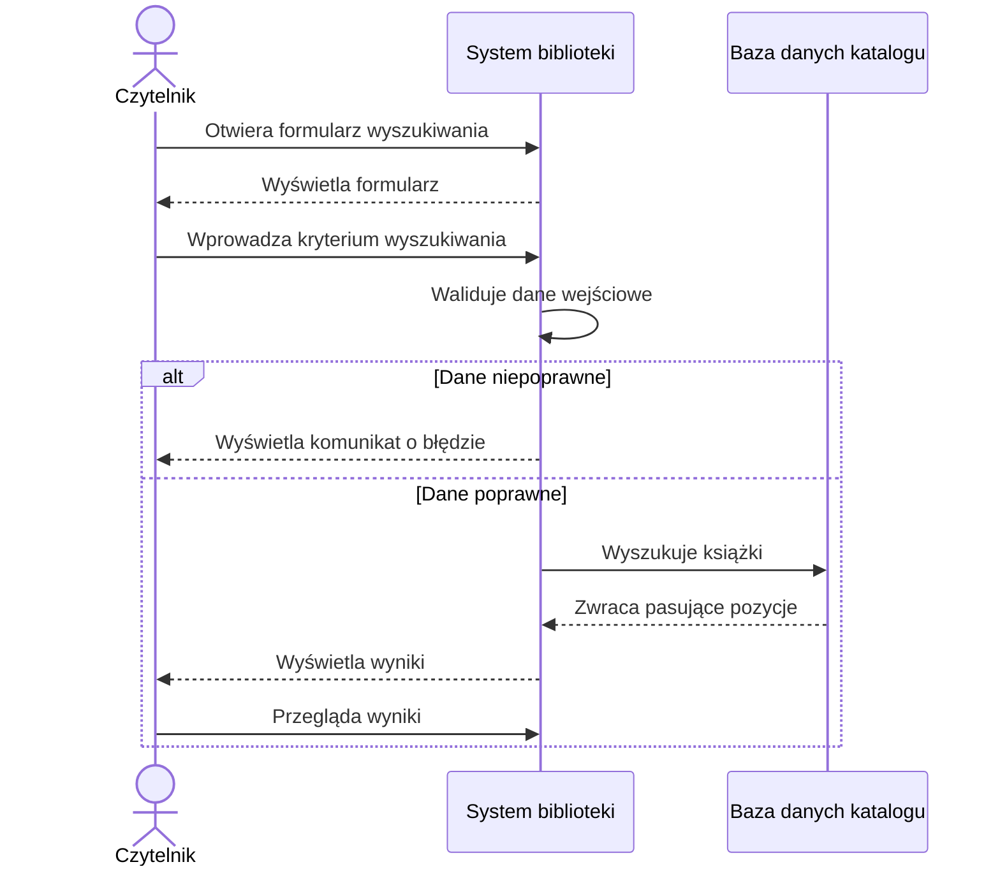

# Diagram sekwencji – Wyszukaj książkę

## Opis

Diagram przedstawia komunikację pomiędzy czytelnikiem, systemem
biblioteki oraz bazą danych katalogu.

Czytelnik przekazuje kryterium wyszukiwania do systemu.

System sprawdza poprawność danych i wysyła zapytanie do bazy danych.

Baza danych zwraca pasujące książki.

System wyświetla czytelnikowi:

- tytuł,
- autora,
- liczbę dostępnych egzemplarzy,
- lokalizację.
