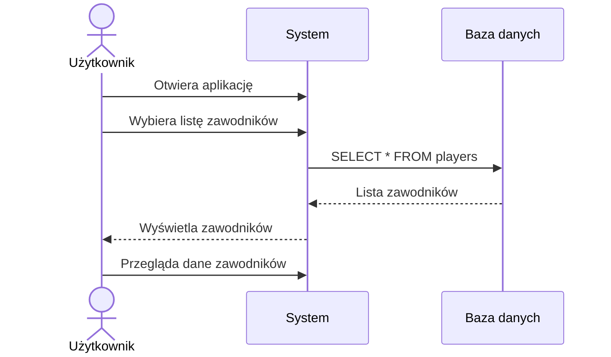
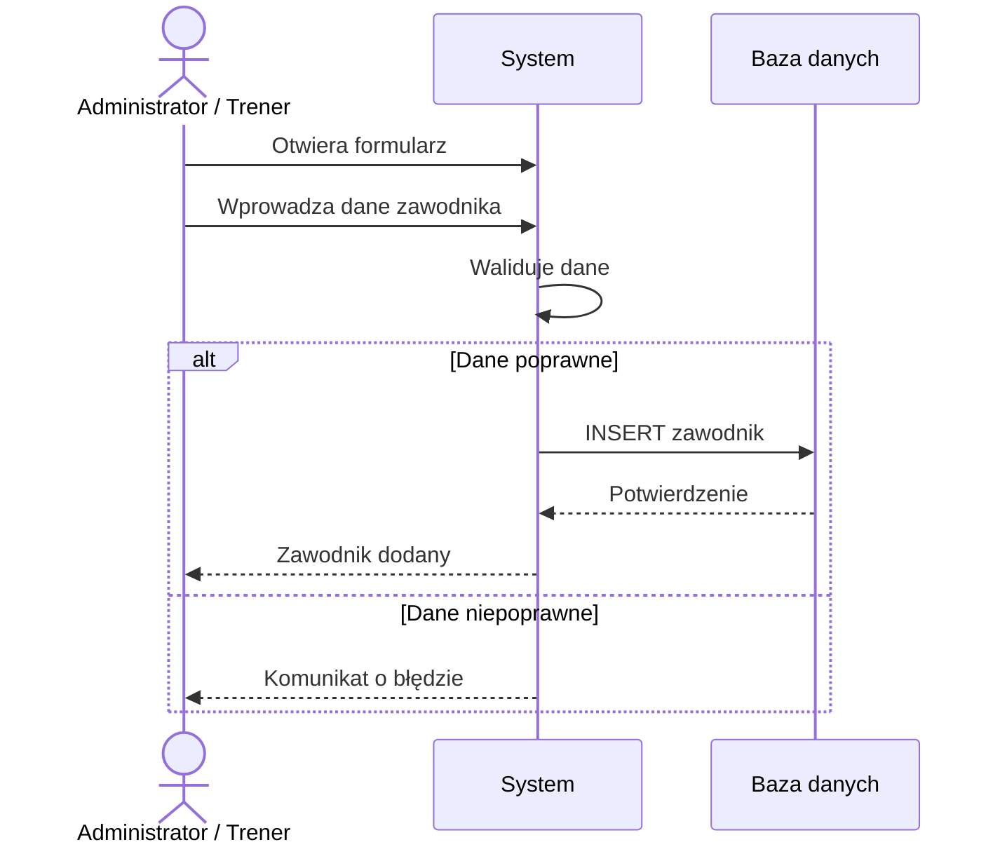
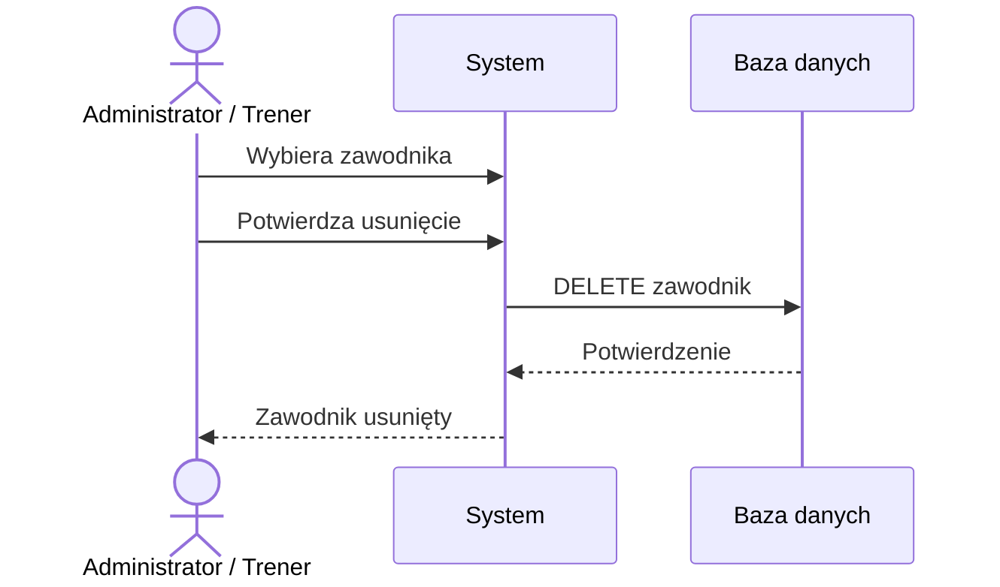

# Diagram sekwencji – wyświetlanie zawodników

```mermaid
sequenceDiagram

    actor U as Użytkownik
    participant S as System
    participant DB as Baza danych

    U->>S: Otwiera aplikację
    U->>S: Wybiera listę zawodników

    S->>DB: SELECT * FROM players
    DB-->>S: Lista zawodników

    S-->>U: Wyświetla zawodników

    U->>S: Przegląda dane zawodników
```

# Diagram sekwencji – dodawanie zawodnika

```mermaid
sequenceDiagram

    actor A as Administrator / Trener
    participant S as System
    participant DB as Baza danych

    A->>S: Otwiera formularz
    A->>S: Wprowadza dane zawodnika

    S->>S: Waliduje dane

    alt Dane poprawne
        S->>DB: INSERT zawodnik
        DB-->>S: Potwierdzenie
        S-->>A: Zawodnik dodany
    else Dane niepoprawne
        S-->>A: Komunikat o błędzie
    end
```

# Diagram sekwencji – usuwanie zawodnika

```mermaid
sequenceDiagram

    actor A as Administrator / Trener
    participant S as System
    participant DB as Baza danych

    A->>S: Wybiera zawodnika
    A->>S: Potwierdza usunięcie

    S->>DB: DELETE zawodnik
    DB-->>S: Potwierdzenie

    S-->>A: Zawodnik usunięty
```
